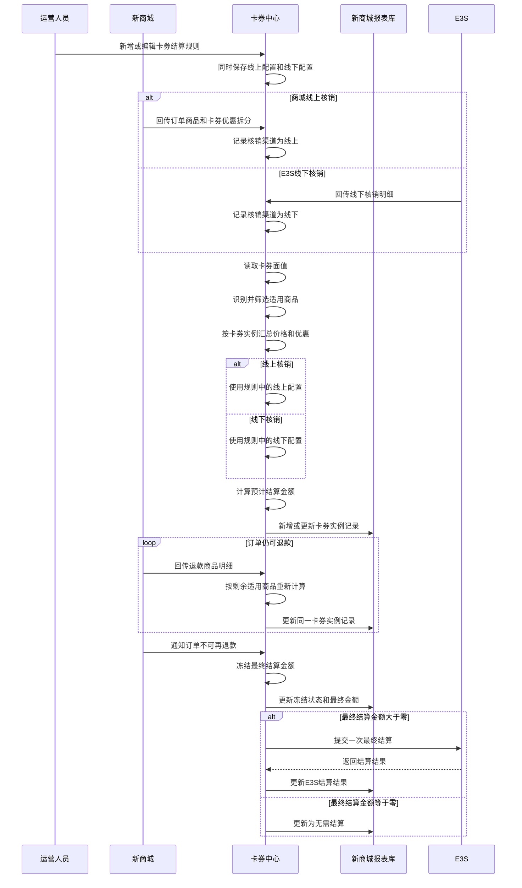

# 商城卡券结算改造 PRD

## 1. 文档信息

| 项目 | 内容 |
|---|---|
| 文档名称 | 商城卡券结算改造 PRD |
| 文档版本 | V1.0 |
| 文档状态 | 评审稿 |
| 更新日期 | 2026-07-23 |
| 涉及系统 | 新商城、卡券中心、E3S、新商城报表库 |
| 原型地址 | `http://127.0.0.1:8080/` |

## 2. 需求背景

除线上商城外，现有卡券已经可以根据核销规则完成结算。线上商城卡券无法正常进入该流程，原因是卡券中心无法获知一张订单中：

1. 哪些商品实际适用某张卡券。
2. 某张卡券在每个适用商品上实际优惠了多少。
3. 退款后应从该卡券实例中扣减多少优惠。
4. 采用商城商品价格、实际优惠金额或网点价时，具体结算基数是多少。

因此，需要由新商城提供订单商品与卡券实例的拆分数据，卡券中心只汇总适用商品，并复用原有卡券结算规则完成计算。订单不可再退款后，卡券中心冻结最终金额并提交 E3S 完成最终结算。

## 3. 产品目标

### 3.1 目标

1. 支持商城卡券按订单商品和卡券实例维度计算结算金额。
2. 保证不适用本卡券的商品不进入补贴计算。
3. 支持退款商品级重算，保证冻结前的结算金额始终与剩余适用商品一致。
4. 复用原有卡券结算规则，不新增商城专属规则类型。
5. 规则同时维护线上和线下配置，实际结算时根据核销渠道自动选择。
6. 订单不可退款后提交一次 E3S 最终结算，不引入账期和结算批次。
7. 形成卡券实例级统计报表，完整追溯商品、价格、规则、退款和结算结果。

### 3.2 非目标

1. 本期不设计商城端订单拆分操作界面。
2. 本期不引入账期管理。
3. 本期不生成 E3S 结算批次。
4. 本期不提供人工勾选、人工汇总或批量提交 E3S。
5. 本期不新增商城专属结算规则。
6. 本期不将退款生成一条负数卡券实例记录。
7. 本期不改造原有线下结算规则的业务含义。

## 4. 名词定义

| 名词 | 定义 |
|---|---|
| 卡券实例 | 发放给用户并可被实际使用的一张具体卡券，报表以卡券实例 ID 为统计主键 |
| 适用商品 | 满足该卡券使用范围、允许分摊该卡券优惠的订单商品 |
| 不适用商品 | 与卡券同处一张订单，但不满足该卡券适用范围的商品 |
| 核销渠道 | 本次卡券实际在线上或线下使用，枚举为线上、线下 |
| 核销来源 | 核销明细的来源系统，商城来源对应线上，E3S 来源对应线下 |
| 预计结算金额 | 订单仍可退款时，根据当前有效商品和优惠计算的预览金额 |
| 最终结算金额 | 订单不可退款后冻结，并用于提交 E3S 的金额 |
| 价格标准值 | 结算规则选中的计算基准，包括商城商品单价、实际优惠金额、卡券面值或网点价 |

## 5. 已确认业务口径

1. 报表一行对应一个卡券实例 ID。
2. 一张订单内并非所有商品都适用同一张卡券。
3. 只有适用商品可以参与商城价、实际优惠金额、网点价和退款扣减的汇总。
4. 不适用商品必须保留在商品明细中，并明确标注“不适用”及原因。
5. 商城传入商城商品单价、实际优惠金额和网点价。
6. 卡券面值由卡券中心自行读取，商城不传。
7. 退款后按退款商品重新计算。
8. 订单仍可退款时只展示预计结算金额，不提交 E3S。
9. 订单不可再退款后冻结最终金额，再提交 E3S。
10. 每次订单冻结通过接口提交一次结算，不生成结算批次。
11. 报表数据库由新商城提供，卡券中心通过接口写入。
12. 规则维护页面隐藏结算渠道，每套规则同时配置线上和线下部分。
13. 实际结算时根据卡券实例的核销渠道选择线上或线下配置。
14. 列表只展示 VIN、手机号码、oneID，不展示“归属类型”。
15. 核销渠道与核销来源分开记录，最终提交 E3S 不改变原核销来源。

## 6. 系统职责

| 系统 | 主要职责 |
|---|---|
| 新商城 | 拆分订单商品与卡券实例的关系；提供商品价格、实际优惠、网点价及适用性判定所需信息；回传退款商品；通知订单不可再退款 |
| 卡券中心 | 读取卡券面值；识别或接收商品适用性；按卡券实例汇总；选择规则配置；计算和冻结金额；写入报表；提交 E3S |
| E3S | 提供现有线下核销数据；接收最终结算请求；返回受理和最终结算结果 |
| 新商城报表库 | 保存卡券中心写入的卡券实例结算记录及商品明细，支持后续查询和对账 |

## 7. 整体业务流程

## 8. 功能需求

### FR-01 卡券结算规则维护

#### 需求说明

沿用原有卡券规则设置页面和增删改查能力，不新增商城专属规则。

#### 页面要求

1. 保留规则 ID、模板 ID、模板名称查询。
2. 保留新增、编辑、删除、导出功能。
3. 规则列表不展示“结算渠道”列。
4. 新增和编辑弹窗不展示“结算渠道”字段。
5. 每套规则必须同时展示并维护：
   - 线上补贴计算规则。
   - 线上结算价格标准值。
   - 线下补贴条件。
   - 线下补贴计算规则。
   - 线下结算价格标准值。
   - 上门取送车补贴条件。
6. 已经产生核销记录的规则禁止编辑和删除。

#### 线上价格标准值

| 价格标准值 | 数据来源 | 计算范围 |
|---|---|---|
| 商城商品单价 | 商城传入 | 仅适用商品 |
| 实际优惠金额 | 商城传入 | 仅适用商品，并扣除已退适用商品优惠 |
| 卡券面值 | 卡券中心读取 | 单张卡券实例面值 |
| 网点价 | 商城传入 | 仅适用商品 |

### FR-02 商城订单商品拆分

商城需要按“订单商品 + 卡券实例”提供拆分明细，使卡券中心可以明确：

1. 订单中的商品。
2. 商品关联的卡券实例。
3. 商品与卡券的关系及适用性判定所需信息。
4. 商品因该卡券实际优惠的金额。
5. 商品对应的商城商品单价。
6. 商品对应的网点价。
7. 商品后续是否退款，以及应扣减的优惠金额。

同一订单使用多张卡券时，每张卡券分别建立商品关系和优惠分摊，禁止只回传订单级优惠总额。

### FR-03 商品适用性处理

1. 每个订单商品必须形成“适用”或“不适用”结果。
2. 适用商品参与结算汇总。
3. 不适用商品：
   - 不计入商城商品价格汇总。
   - 不计入实际优惠金额汇总。
   - 不计入网点价汇总。
   - 不参与退款优惠扣减。
   - 保留在详情中用于核对。
4. 页面展示适用结果及判定原因。
5. 商品适用性判定责任方尚待接口评审确认；当前原型以商城回传适用标记进行演示，不代表最终责任归属。

### FR-04 卡券实例汇总

卡券中心以卡券实例 ID 为主键，汇总该实例关联的适用商品。

实例记录至少需要保留：

1. 订单号、卡券实例 ID、卡券模板信息。
2. VIN、手机号码、oneID。
3. 核销渠道和核销来源。
4. 订单商品总数、适用商品数。
5. 适用商品商城价合计。
6. 适用商品实际优惠合计。
7. 卡券面值。
8. 适用商品网点价合计。
9. 使用的规则 ID、规则版本和价格标准值。
10. 结算基数、预计结算金额、最终结算金额。
11. 退款扣减、冻结状态和 E3S 结算状态。

### FR-05 运行时规则路由

规则保存时不配置渠道。计算时根据卡券实例的核销渠道自动选择：

| 核销渠道 | 使用配置 |
|---|---|
| 线上 | 规则中的线上配置 |
| 线下 | 规则中的线下配置 |

若核销渠道为空或不在枚举范围内，系统不得计算或提交 E3S，应记录异常并进入人工核对。

### FR-06 结算金额计算

设卡券实例的适用商品集合为 `A`。

#### 实际优惠金额

`有效优惠金额 = A 中商品优惠金额合计 - A 中已退商品对应优惠金额合计`

有效优惠金额最低为 0。

#### 比例结算

`预计或最终结算金额 = 结算基数 × 规则比例`

结算基数根据规则选中的价格标准值确定。

#### 固定金额结算

沿用原有固定金额结算逻辑，本期不改变计算含义。

#### 金额精度

金额单位、保留小数位数和舍入方式沿用原结算能力；具体接口精度需要在技术设计中确认。

### FR-07 退款重算

1. 订单退款窗口关闭前，商城按退款商品回传退款明细。
2. 卡券中心判断退款商品是否属于该卡券实例的适用商品。
3. 仅扣减已退适用商品对应的优惠。
4. 根据剩余适用商品重新汇总价格和优惠。
5. 重新选择对应渠道的规则配置并计算预计结算金额。
6. 更新同一卡券实例记录，不新增负数实例行。
7. 不适用商品退款不得影响该卡券实例的结算金额。
8. 全部适用商品退款后，有效优惠及应结算金额均为 0。

### FR-08 金额冻结

1. 订单仍可退款时，状态为“退款窗口内”，金额仅供预览。
2. 收到订单不可再退款事件后，卡券中心重新执行一次完整计算。
3. 计算完成后冻结订单关联卡券实例的最终金额。
4. 冻结后不得再按普通退款流程修改最终金额。
5. 冻结时间、最终规则版本、结算基数和最终结算金额必须留痕。

### FR-09 E3S 最终结算

1. E3S 是整个结算流程的最后一步。
2. 只有订单不可再退款且金额已冻结后才能提交。
3. 不生成结算批次，不需要人工勾选。
4. 每次订单冻结通过接口提交一次结算。
5. 请求携带唯一请求 ID，保证同一冻结订单不会重复结算。
6. 最终结算金额大于 0 时提交 E3S。
7. 最终结算金额等于 0 时不提交 E3S，实例更新为“无需结算”。
8. 保存 E3S 请求 ID、受理状态、结算单号、最终结果和时间。

### FR-10 卡券实例结算报表

#### 数据归属

1. 报表数据库由新商城提供。
2. 卡券中心通过接口新增或更新数据。
3. 同一卡券实例的退款、冻结及 E3S 结果更新同一条主记录。

#### 列表字段

| 分类 | 字段 |
|---|---|
| 标识 | 卡券实例 ID、订单号、卡券名称、卡券编码 |
| 用户 | VIN、手机号码、oneID |
| 核销 | 核销渠道、核销来源 |
| 商品 | 订单商品数、适用商品数 |
| 价格 | 适用商品商城价合计、适用商品实际优惠、卡券面值、适用商品网点价合计 |
| 规则 | 价格标准类型、规则 ID、规则版本 |
| 结果 | 结算基数、预计或最终结算金额、结算状态 |
| E3S | 请求 ID、提交时间、结算单号、结果 |

列表不得出现“归属类型”。

#### 详情字段

1. 订单商品名称及 SKU。
2. 商品适用或不适用结果。
3. 适用性原因。
4. 商城商品单价、网点价。
5. 商品分摊优惠。
6. 退款扣减。
7. 商品状态。
8. 四项价格快照及数据来源。
9. 运行时选择的线上或线下配置。
10. 结算公式和结果。
11. 商品回传、退款重算、金额冻结及 E3S 结算时间线。

## 9. 数据要求

### 9.1 商城至卡券中心

以下为业务字段要求，最终字段名由接口设计确定。

| 业务字段 | 必需 | 说明 |
|---|---|---|
| 事件唯一标识 | 是 | 用于防止重复接收同一回传事件 |
| 订单号 | 是 | 商城订单唯一标识 |
| 卡券实例 ID | 是 | 卡券结算统计主键 |
| 卡券模板 ID | 建议 | 用于匹配结算规则 |
| 商品 ID 或 SKU | 是 | 商品唯一标识 |
| 商品数量 | 待确认 | 多数量商品的金额汇总需要使用 |
| 商品适用标记 | 待确认 | 若由商城判定则必须回传；若由卡券中心判定，则商城需要提供完整判定所需信息 |
| 适用性原因 | 待确认 | 用于详情核对，随最终判定责任一并确认 |
| 商城商品单价 | 是 | 商城传入 |
| 实际优惠金额 | 是 | 该商品因该卡券产生的优惠 |
| 网点价 | 是 | 商城传入 |
| 退款商品标识 | 退款时必需 | 指向原订单商品 |
| 退款优惠扣减金额 | 退款时必需 | 该退款商品需要扣减的卡券优惠 |
| VIN | 按实际数据 | 无值时为空 |
| 手机号码 | 按实际数据 | 无值时为空 |
| oneID | 按实际数据 | 无值时为空 |
| 订单是否可退款 | 是 | 用于判断是否允许冻结 |
| 业务发生时间 | 是 | 用于审计和事件排序 |

商城不传卡券面值。

### 9.2 卡券中心至报表库

建议采用“卡券实例主记录 + 商品明细记录”的结构：

1. 主记录保存卡券实例汇总、规则、金额、状态及 E3S 结果。
2. 商品明细保存适用性、价格、优惠、退款和商品状态。
3. 主记录以卡券实例 ID 作为业务唯一键。
4. 商品明细建议以卡券实例 ID、订单号和商品行标识组成业务唯一键。
5. 写入接口必须支持幂等新增和更新。

### 9.3 卡券中心至 E3S

最终字段由 E3S 接口评审确认，业务上至少需要：

1. 唯一请求 ID。
2. 订单号。
3. 卡券实例 ID。
4. VIN、手机号码、oneID 中实际存在的值。
5. 最终结算金额。
6. 规则 ID 和规则版本。
7. 核销渠道。
8. 冻结时间。

## 10. 状态设计

| 状态 | 进入条件 | 可执行操作 |
|---|---|---|
| 退款窗口内 | 已完成核销明细汇总，订单仍可退款 | 接收退款、重算、查看预计金额 |
| E3S 处理中 | 订单不可退款，金额已冻结并已提交 E3S | 查询接口结果，不允许普通退款重算 |
| 已结算 | E3S 返回最终成功结果 | 查询、导出、对账 |
| 无需结算 | 全部适用商品退款或最终结算金额为 0 | 查询、导出 |
| 结算异常 | 数据缺失、渠道无效或 E3S 返回失败 | 记录异常，等待核对或重试方案 |

## 11. 异常与幂等

1. 同一商城事件重复到达时，不得重复累计商品优惠或退款金额。
2. 同一卡券实例收到乱序事件时，应根据业务发生时间和事件版本处理。
3. 同一冻结订单不得生成多笔 E3S 业务结算。
4. E3S 接口重复调用必须复用同一请求 ID。
5. 商品适用性、商品价格或优惠字段缺失时，不得冻结和提交 E3S。
6. 核销渠道为空或无效时，不得选择规则分支。
7. 卡券实例与规则无法匹配时，进入结算异常，不使用默认规则兜底。
8. 卡券中心汇总金额与商城明细无法对平时，进入异常并保留原始回传证据。

## 12. 权限与审计

1. 规则查询、导出权限沿用原功能。
2. 规则新增、编辑、删除权限沿用原功能。
3. 已产生核销记录的规则禁止编辑和删除。
4. 商品明细、规则版本、计算结果、退款、冻结和 E3S 提交均需要记录操作或系统事件时间。
5. 报表金额字段必须可以追溯至具体商品明细。

## 13. 验收标准

| 编号 | 验收场景 | 预期结果 |
|---|---|---|
| AC-01 | 一张订单有 3 件商品，其中 2 件适用卡券 | 只汇总 2 件适用商品；第 3 件显示不适用且不进入计算 |
| AC-02 | 线上商城卡券实例进入计算 | 自动使用同一规则中的线上配置 |
| AC-03 | 线下 E3S 卡券实例进入计算 | 自动使用同一规则中的线下配置 |
| AC-04 | 规则新增或编辑 | 页面无结算渠道字段，线上和线下配置始终同时可见 |
| AC-05 | 已产生核销记录的规则执行编辑或删除 | 系统明确阻止操作 |
| AC-06 | 适用商品发生部分退款 | 扣减该商品优惠并更新同一卡券实例预计金额 |
| AC-07 | 不适用商品发生退款 | 卡券实例结算基数和结算金额不变 |
| AC-08 | 全部适用商品退款 | 有效优惠和结算金额为 0，状态为无需结算，不提交 E3S |
| AC-09 | 订单仍可退款 | 只展示预计金额，不产生 E3S 请求 |
| AC-10 | 订单不可退款并完成冻结 | 生成一次带唯一请求 ID 的 E3S 提交记录 |
| AC-11 | 重复收到同一冻结事件 | 不产生第二笔 E3S 业务结算 |
| AC-12 | 商城回传价格数据 | 商城商品单价、实际优惠金额、网点价来自商城；卡券面值来自卡券中心 |
| AC-13 | 查看实例报表 | 一张卡券实例一行，只展示 VIN、手机号码、oneID，不展示归属类型 |
| AC-14 | 查看实例详情 | 可以追溯适用商品、价格快照、退款、规则分支、公式和 E3S 结果 |
| AC-15 | 卡券中心写入报表 | 同一卡券实例按状态更新，不因退款生成负数实例行 |

## 14. 非功能要求

1. 金额计算和报表写入必须具备幂等能力。
2. 商品明细、实例汇总和 E3S 结果之间需要保证最终一致。
3. 接口失败需要具备可监控、可重试和可对账能力。
4. 所有金额字段需要明确币种、单位、精度和舍入方式。
5. 所有状态变化需要保留时间和来源系统。
6. 报表查询需要支持卡券实例 ID、订单号、VIN、手机号码、oneID、核销渠道、核销来源和结算状态。

## 15. 待确认事项

| 编号 | 待确认问题 | 影响 |
|---|---|---|
| Q-01 | 商品适用性由商城直接判定，还是由卡券中心根据券适用范围再次校验 | 决定接口字段、责任边界和异常处理 |
| Q-02 | 商城商品单价在多数量商品下按单价、商品行金额还是实付商品金额汇总 | 影响商城商品单价作为价格标准值时的计算公式 |
| Q-03 | 网点价在多数量商品下的数量和金额口径 | 影响网点价汇总 |
| Q-04 | 商城“订单不可再退款”的精确判定条件和通知事件 | 决定冻结时点 |
| Q-05 | E3S 单次订单结算接口字段、幂等键、超时重试和结果回传方式 | 决定最终结算接口设计 |
| Q-06 | 新商城报表库的表结构、唯一索引、写入接口和更新策略 | 决定数据落库方案 |
| Q-07 | oneID 或手机号变化后，报表保存实时值还是核销时快照 | 影响历史追溯 |
| Q-08 | 冻结后若出现极端退款或撤销，应进入异常处理还是另行冲正 | 当前方案不使用账期负数调整 |
| Q-09 | 固定金额结算是否需要受到实际优惠或卡券面值上限约束 | 沿用原规则前需要核对现有实现 |

## 16. 上线依赖

1. 商城订单商品与卡券实例拆分能力。
2. 商城商品适用性及优惠分摊数据。
3. 商城退款商品回传和不可退款事件。
4. 卡券中心规则页面及运行时路由改造。
5. 卡券中心实例汇总、退款重算和金额冻结能力。
6. 新商城报表库及写入接口。
7. E3S 最终结算接口。
8. 跨系统幂等、重试、监控和对账方案。
